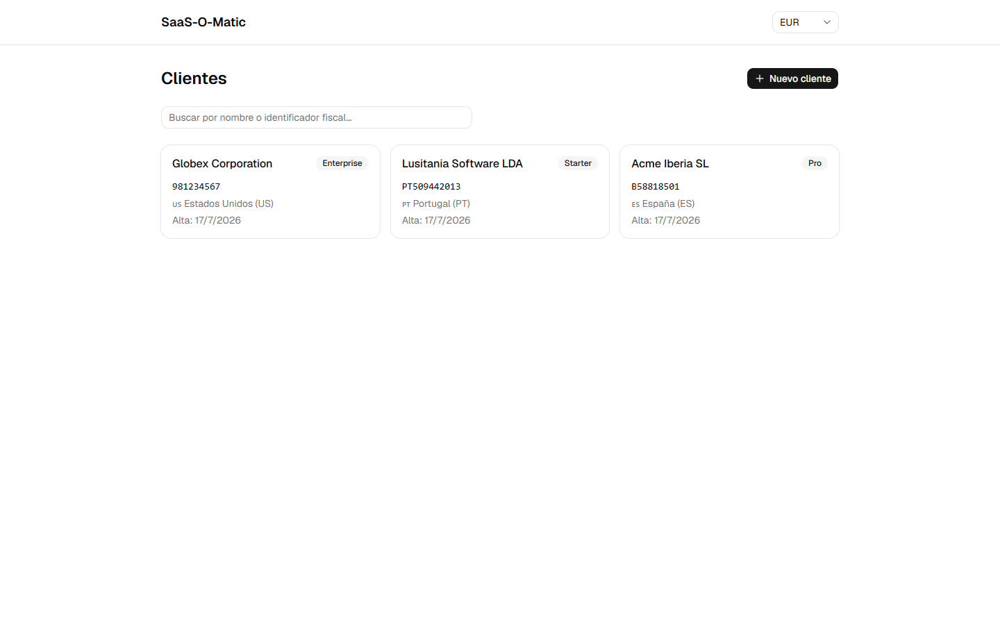
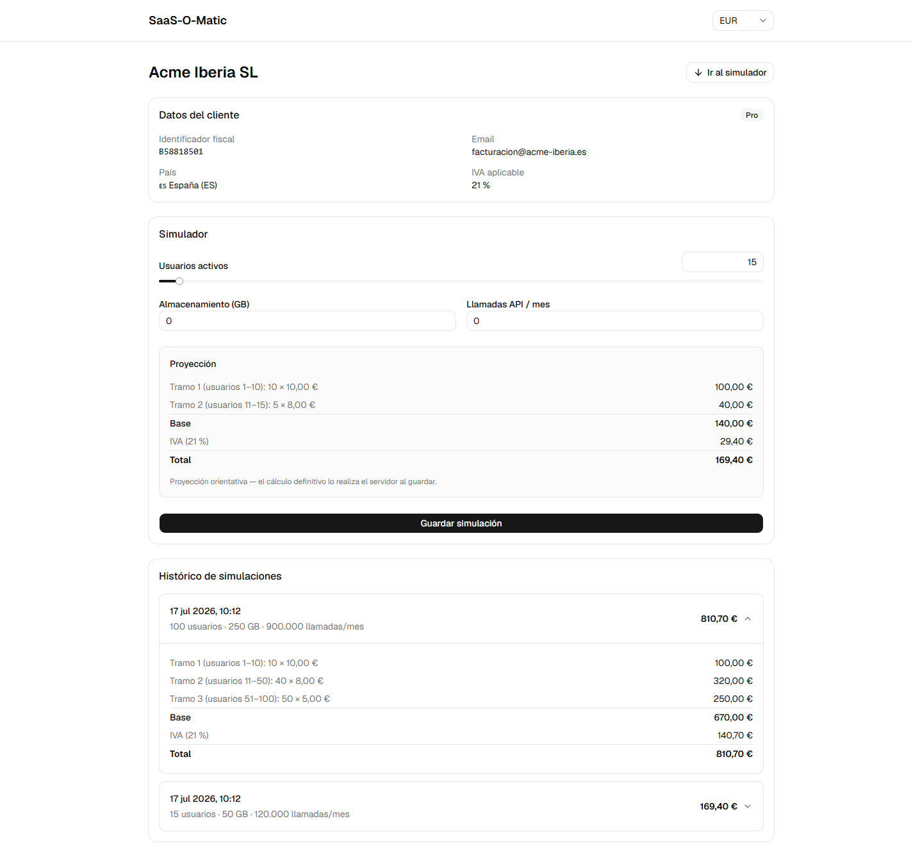
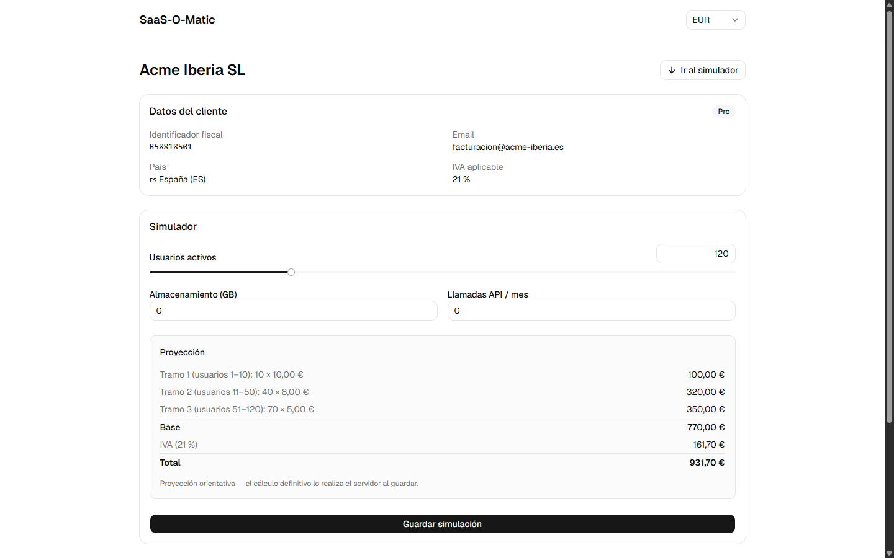
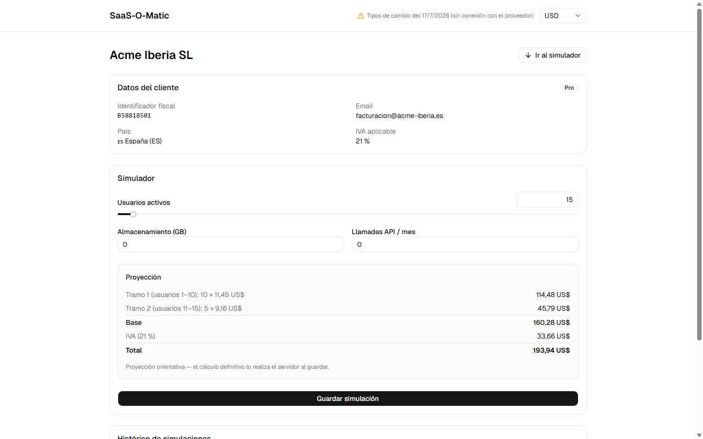

# SaaS-O-Matic — Dynamic Billing & Subscription Optimizer

Herramienta interna para simular, optimizar y presupuestar suscripciones SaaS multi-divisa para clientes corporativos. Backend NestJS + Prisma + SQLite · Frontend React + Vite + TypeScript.



## Arranque rápido

Requisitos: **Node ≥ 20** y **pnpm** (`npm i -g pnpm`).

```bash
# Terminal 1 — API (http://localhost:3000, Swagger en /docs)
cd backend && pnpm install && pnpm db:setup && pnpm start:dev

# Terminal 2 — Dashboard (http://localhost:5173)
cd frontend && pnpm install && pnpm dev
```

No hace falta configurar nada más: no hay `.env` que rellenar (el frontend apunta a `http://localhost:3000` por defecto, configurable con `VITE_API_URL`) y `pnpm db:setup` genera el cliente Prisma, aplica las migraciones y siembra la base de datos.

<details>
<summary>Alternativa con Docker (un solo comando, sin Node ni pnpm)</summary>

```bash
docker compose up --build
```

Levanta la API en `:3000` (con migraciones y seed aplicados sobre un volumen) y el dashboard en `:5173`.

</details>

### Datos demo

El seed deja la aplicación lista para probar sin dar de alta nada:

- **10 países** con su IVA (ES 21 %, PT 23 %, DE 19 %, US 0 %…) y **3 planes** (Starter, Pro, Enterprise).
- **3 clientes**: `Acme Iberia SL` (ES, CIF `B58818501`), `Lusitania Software LDA` (PT) y `Globex Corporation` (US).
- **4 simulaciones** ya persistidas en su histórico; tres de ellas son casos dorados de la spec de pricing (15 → 140 €, 100 → 670 €, 200 → 1.170 € de base).

## Scripts

| App | Script | Descripción |
|---|---|---|
| backend | `pnpm start:dev` | API en `:3000` con recarga (Swagger en `/docs`) |
| backend | `pnpm db:setup` | `prisma generate` + migraciones + seed |
| backend | `pnpm test` / `pnpm test:e2e` | tests unitarios / e2e |
| backend | `pnpm lint` / `pnpm lint:ci` | linting (con `--fix` / en modo gate, sin arreglar) |
| frontend | `pnpm dev` / `pnpm build` | dashboard en `:5173` / build de producción |
| frontend | `pnpm test` | tests (vitest) |
| frontend | `pnpm test:e2e` | smoke e2e (Playwright); requiere la API levantada |
| frontend | `pnpm lint` | linting (oxlint) |

## Funcionalidad

- **Alta de clientes** con validación algorítmica oficial de DNI/NIE/CIF cuando el país es España.
- **Buscador** por nombre de empresa o identificador fiscal.
- **Detalle de cliente** con histórico de simulaciones persistidas (desglose por tramos e IVA).
- **Simulador interactivo**: slider con proyección en tiempo real (tarificación acumulativa por tramos + IVA del país).
- **Multi-divisa**: conversión de visualización en vivo vía [open.er-api.com](https://open.er-api.com), con degradación a la última tasa conocida si el proveedor no responde.

## Arquitectura (resumen)

- Lógica de negocio (pricing por tramos, validación fiscal) en **capa de dominio pura** sin framework, con cobertura total y casos dorados compartidos entre backend y frontend.
- Capas estrictas en el backend: `controller → service → domain/prisma`; un controller nunca toca Prisma ni contiene lógica.
- Importes en **céntimos enteros** y tipos en puntos básicos; EUR es la divisa canónica y la conversión de divisa es solo presentación (nunca se persiste un importe convertido).
- Cada simulación persiste una **instantánea** del cálculo, de modo que el histórico es inmutable ante cambios de tarifas.
- Validación en el borde con DTOs (`whitelist: true`) y un contrato de error global con códigos semánticos.

Detalle completo: [`ai-workspace/02-arquitectura/`](ai-workspace/02-arquitectura/).

## Cómo se construyó con IA

El diseño, las specs, los planes de fase y el control de calidad del código generado están documentados en [`ai-workspace/`](ai-workspace/) — empezar por [**`00-metodologia.md`**](ai-workspace/00-metodologia.md).

| Carpeta | Contenido |
|---|---|
| [`01-specs/`](ai-workspace/01-specs/) | Reglas de negocio, contratos de API, validaciones, spec de frontend |
| [`02-arquitectura/`](ai-workspace/02-arquitectura/) | Decisiones (ADRs), esquema de BD, estructura de carpetas, directrices para la IA |
| [`03-prompts/`](ai-workspace/03-prompts/) | Los 10 planes de acción (fases 0–9) usados para guiar a la IA |
| [`04-proceso/`](ai-workspace/04-proceso/) | Registro de decisiones y auditorías de cada fase |

## Capturas

**Detalle de cliente con histórico de simulaciones**



**Simulador interactivo con proyección en vivo**



**Degradación de la API de divisas: se mantiene la última tasa conocida**


