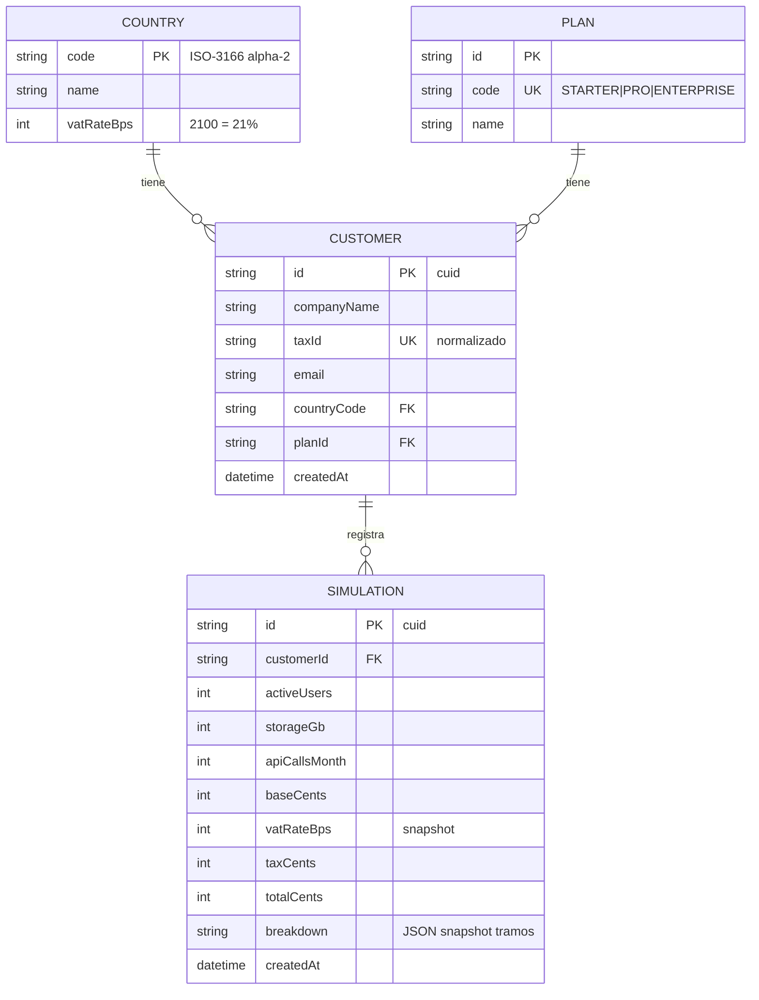

# Estructura de la base de datos

SQLite gestionada con Prisma 7 (migraciones versionadas y commiteadas).

> **Convenciones Prisma 7** (actualización 2026-07-16): la URL del datasource vive en
> `prisma.config.ts` (no en `schema.prisma`), el cliente se genera con el provider
> `prisma-client` (emite TypeScript en `src/generated/prisma/`, carpeta ignorada por git)
> y `PrismaClient` exige un driver adapter (`@prisma/adapter-better-sqlite3`) en el
> constructor — sin adapter lanza `P2038`.

## Diagrama entidad-relación



## `prisma.config.ts` (raíz de `backend/`)

```ts
import { defineConfig } from 'prisma/config';

export default defineConfig({
  schema: 'prisma/schema.prisma',
  migrations: {
    path: 'prisma/migrations',
    seed: 'ts-node prisma/seed.ts',
  },
  datasource: {
    url: 'file:./prisma/dev.db',
  },
});
```

- La URL SQLite se resuelve relativa a `prisma.config.ts` → la BD queda en `backend/prisma/dev.db`.
- El comando de seed vive aquí (en Prisma 7 ya no se usa el campo `prisma.seed` de `package.json`).

## `prisma/schema.prisma`

```prisma
generator client {
  provider            = "prisma-client"
  output              = "../src/generated/prisma"
  moduleFormat        = "cjs"
  importFileExtension = ""
}

datasource db {
  provider = "sqlite"
}

model Country {
  code      String     @id
  name      String
  vatRateBps Int
  customers Customer[]
}

model Plan {
  id        String     @id @default(cuid())
  code      String     @unique
  name      String
  customers Customer[]
}

model Customer {
  id          String       @id @default(cuid())
  companyName String
  taxId       String       @unique
  email       String
  countryCode String
  planId      String
  country     Country      @relation(fields: [countryCode], references: [code])
  plan        Plan         @relation(fields: [planId], references: [id])
  simulations Simulation[]
  createdAt   DateTime     @default(now())

  @@index([companyName])
}

model Simulation {
  id            String   @id @default(cuid())
  customerId    String
  customer      Customer @relation(fields: [customerId], references: [id])
  activeUsers   Int
  storageGb     Int
  apiCallsMonth Int
  baseCents     Int
  vatRateBps    Int
  taxCents      Int
  totalCents    Int
  breakdown     String
  createdAt     DateTime @default(now())

  @@index([customerId, createdAt])
}
```

## Notas de diseño

- **Driver adapter obligatorio** (Prisma 7): `PrismaService` instancia `new PrismaClient({ adapter: new PrismaBetterSqlite3({ url: 'file:./prisma/dev.db' }) })`. La URL del adapter se resuelve relativa al cwd del proceso (`backend/`).
- **Cliente generado en `src/generated/prisma/`**: TypeScript emitido por `prisma generate`; ignorado por git, eslint y prettier. Un clon limpio lo regenera (`db:setup` incluye `prisma generate`).
- **`taxId` único y normalizado** (RN-04): la unicidad se garantiza en BD, no solo en la aplicación.
- **`breakdown` como `String` JSON**: SQLite no tiene tipo JSON nativo en Prisma; se serializa/deserializa en el servicio con tipo `TierLine[]` del dominio. Es un snapshot inmutable (ADR-06), no se consulta por dentro → no necesita columnas propias.
- **`vatRateBps` duplicado en `Simulation`**: snapshot intencionado del tipo aplicado (el de `Country` puede cambiar).
- **Sin `DELETE` en el alcance**: no se exponen borrados; las FKs quedan con el comportamiento restrictivo por defecto.
- **Índices**: búsqueda por nombre (`companyName`) e histórico por cliente ordenado (`customerId, createdAt`).

## Seed (`prisma/seed.ts`)

Idempotente (upserts), ejecutable con `pnpm db:seed`:

1. 10 países de RN-02 con su IVA en bps.
2. 3 planes: `STARTER`, `PRO`, `ENTERPRISE`.
3. **Datos demo para el evaluador**: 3 clientes (ES con CIF válido `B58818501`, PT, US) y 4–5 simulaciones variadas (una con 15 usuarios → 140 € base, el ejemplo del enunciado).
